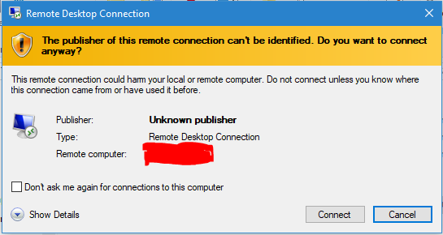
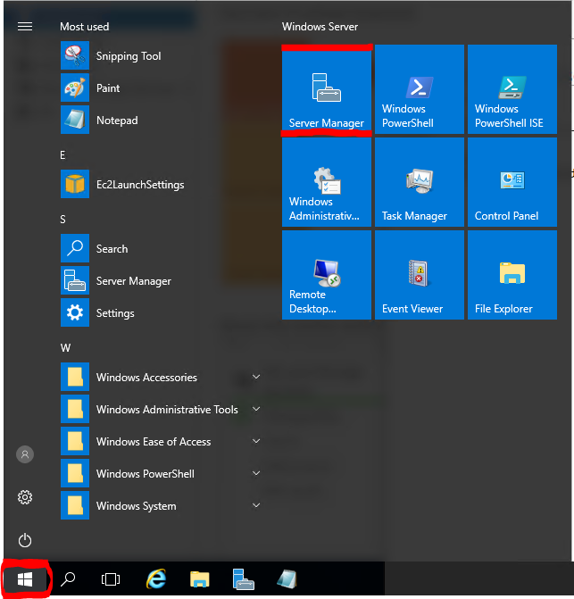
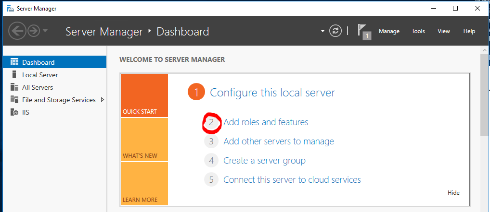
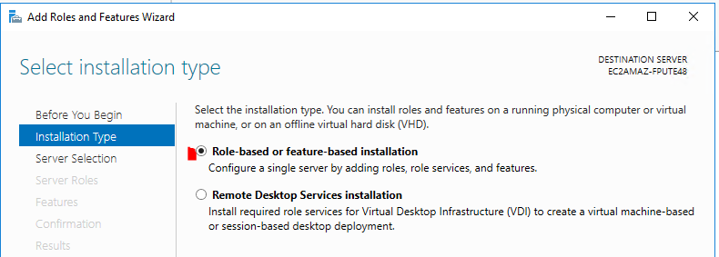
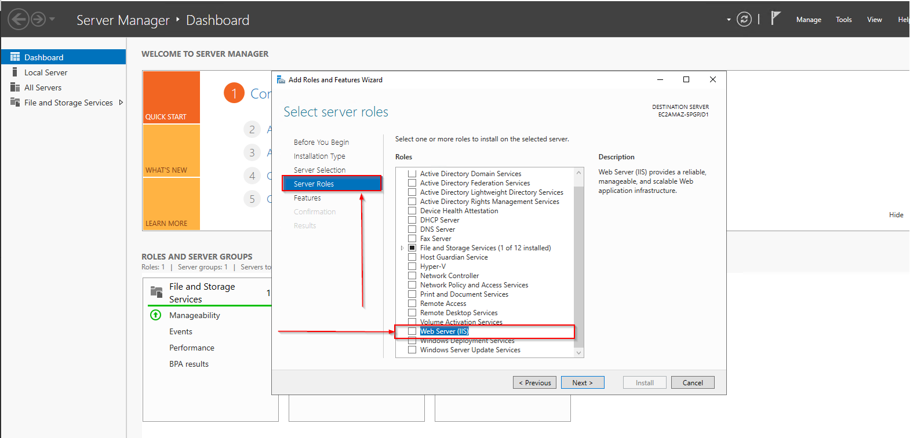
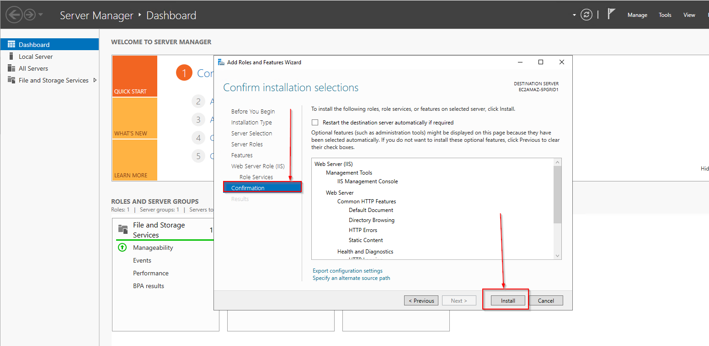

# Connect Windows Machine on AWS From Window PC

Below is a step-by-step guide with Terraform code to create a Windows EC2 instance in AWS and connect to it from a Windows laptop. This guide will include the necessary infrastructure components (VPC, Subnet, Security Group, etc.) within the Terraform configuration.

**Prerequisites:**

*   **AWS Account:** As before, you need an active AWS account.
*   **Terraform Installed:** Download and install Terraform from [https://www.terraform.io/downloads.html](https://www.terraform.io/downloads.html).
*   **AWS CLI Configured:** Configure the AWS CLI on your machine with your AWS credentials.
*   **Windows Laptop:** You'll need a Windows laptop with the Remote Desktop Connection client.
*   **Basic Terraform Knowledge:** Familiarity with Terraform syntax and concepts is beneficial.
*   **Text Editor or IDE:**  To write and manage your Terraform code (e.g., VS Code).
*   **Local Key Pair (`.pem` file):** We will download the key pair using the AWS CLI as part of this process so we can decrypt the admin password.

**Step-by-Step Guide**

**1. Set up Your Terraform Project:**

   1.  **Create a Project Directory:** Create a new directory (folder) for your Terraform project (e.g., `windows-ec2-terraform`).
   2.  **Create `main.tf`:** Inside the directory, create a file named `main.tf`. This file will contain your Terraform configuration code.
   3.  **Create `variables.tf`:** Inside the directory, create a file named `variables.tf`. This will hold configurable variables.
   4.  **Create `outputs.tf`:** Inside the directory, create a file named `outputs.tf`. This will hold the output of important values once terraform is complete

**2.  Add the `variables.tf` Configuration:**
   
   ```terraform
variable "aws_region" {
  type        = string
  default     = "us-east-1"
  description = "AWS region to deploy resources"
}
variable "windows-ec2-cidr" {
  type        = string
  default     = "10.0.0.0/16"
  description = "windows instance cidr"
}
variable "instance_type" {
  type        = string
  default     = "t2.micro"
  description = "Type of EC2 instance"
}
variable "ami_id" {
  type        = string
  default     = "ami-032ec7a32b7fb247c" # Replace with the latest Windows AMI ID for your region
  description = "AMI ID for the Windows instance"
}
variable "key_name" {
  type        = string
  default     = "aws-terraform-kp"
  description = "Name of the key pair for SSH access"
}
variable "allowed_rdp_cidrs" {
  description = "List of CIDR blocks allowed for RDP access. Defaults to current IP address"
  type        = list(string)
  default     = []
}
```

**3.  Add the `main.tf` Configuration:**

Copy the following Terraform code into `main.tf`:

```terraform
# Description: This Terraform script creates a VPC, subnet, and an internet gateway for a Windows EC2 instance on AWS.

data "http" "myip" {
  url = "http://ipv4.icanhazip.com"
}

# Create VPC
resource "aws_vpc" "aws-windows-ec2" {
  cidr_block = "10.0.0.0/16"

  tags = {
    Name = "aws-windows-ec2-vpc"
  }
}


# Create Internet Gateway
resource "aws_internet_gateway" "aws-windows-ec2-igw" {
  vpc_id = aws_vpc.aws-windows-ec2.id

  tags = {
    Name = "aws-windows-ec2-igw"
  }
}

# Create Subnet
resource "aws_subnet" "aws-windows-ec2-subnet-1" {
  vpc_id                  = aws_vpc.aws-windows-ec2.id
  cidr_block              = "10.0.1.0/24"
  availability_zone       = "${var.aws_region}a"
  map_public_ip_on_launch = true # Enable public IP assignment

  tags = {
    Name = "aws-windows-ec2-subnet-1"
  }
}

# Create Route Table
resource "aws_route_table" "aws-windows-ec2-rt" {
  vpc_id = aws_vpc.aws-windows-ec2.id

  route {
    cidr_block = "0.0.0.0/0" # Route to the internet
    gateway_id = aws_internet_gateway.aws-windows-ec2-igw.id
  }

  tags = {
    Name = "aws-windows-ec2-rt"
  }
}

# Associate Route Table Association
resource "aws_route_table_association" "aws-windows-ec2-rt-assoc" {
  subnet_id      = aws_subnet.aws-windows-ec2-subnet-1.id
  route_table_id = aws_route_table.aws-windows-ec2-rt.id
}

# Create Security Group
resource "aws_security_group" "aws-windows-ec2-sg" {
  vpc_id = aws_vpc.aws-windows-ec2.id

  # Allow inbound traffic on port 3389 (RDP)
  ingress {
    from_port = 3389
    to_port   = 3389
    protocol  = "tcp"
    # cidr_blocks = ["${var.windows-ec2-cidr}"] # Replace with your IP range
    cidr_blocks = length(var.allowed_rdp_cidrs) > 0 ? var.allowed_rdp_cidrs : ["${chomp(data.http.myip.response_body)}/32"]
  }

  ingress {
    from_port   = 443
    to_port     = 443
    protocol    = "tcp"
    cidr_blocks = length(var.allowed_rdp_cidrs) > 0 ? var.allowed_rdp_cidrs : ["${chomp(data.http.myip.response_body)}/32"]
  }

  ingress {
    from_port   = 80
    to_port     = 80
    protocol    = "tcp"
    cidr_blocks = length(var.allowed_rdp_cidrs) > 0 ? var.allowed_rdp_cidrs : ["${chomp(data.http.myip.response_body)}/32"]
  }

  ingress {
    from_port   = -1
    to_port     = -1
    protocol    = "icmp"
    cidr_blocks = length(var.allowed_rdp_cidrs) > 0 ? var.allowed_rdp_cidrs : ["${chomp(data.http.myip.response_body)}/32"]
  }

  # Allow outbound traffic to the internet
  egress {
    from_port   = 0
    to_port     = 0
    protocol    = "-1"
    cidr_blocks = ["0.0.0.0/0"]
  }

  tags = {
    Name = "allow-rdp-from-aws-windows-ec2-sg"
  }
}

# Create Windows EC2 Instance
resource "aws_instance" "windows_server" {
  ami                         = var.ami_id # Replace with the latest Windows Server AMI ID for your region
  instance_type               = var.instance_type
  subnet_id                   = aws_subnet.aws-windows-ec2-subnet-1.id
  security_groups             = [aws_security_group.aws-windows-ec2-sg.id]
  key_name                    = var.key_name # Replace with your key pair name
  associate_public_ip_address = true
  user_data                   = <<-EOF
    <powershell>
    # Install the Web-Server Role
    Install-WindowsFeature -name Web-Server -IncludeManagementTools

    # Create a basic index.html file
    $content = @"
      <!DOCTYPE html>
      <html>
      <head>
          <title>Welcome</title>
      </head>
      <body>
         <h1>Welcome to Windows Server Instance in AWS</h1>
      </body>
      </html>
    "@

    $content | Out-File -Encoding utf8 "C:\inetpub\wwwroot\index.html"

    # Start the web service
    Start-Service W3SVC

   # Enable Remote Desktop
           Set-ItemProperty -Path 'HKLM:\System\CurrentControlSet\Control\Terminal Server' -name "fDenyTSConnections" -value 0

           # Enable Remote Desktop firewall rule
           Enable-NetFirewallRule -DisplayGroup "Remote Desktop"
    </powershell>
  EOF

  tags = {
    Name = "windows-server-instance"
  }
}

```

**4. Add the `outputs.tf` Configuration:**

Copy the following Terraform code into `outputs.tf`:

```terraform
   output "public_ip" {
     value = aws_instance.windows_server.public_ip
   }

   output "private_key" {
    value = tls_private_key.key.private_key_pem
    sensitive = true
   }
```

**5. Initialize Terraform:**

   1.  Open a terminal or command prompt.
   2.  Navigate to the directory containing your `main.tf`, `variables.tf` and `outputs.tf` files.
   3.  Run the command `terraform validate`. The command will validate the code for any errors.
   4.  Run the command `terraform init`. This command initializes the Terraform project and downloads the necessary provider plugins.


**6.  Apply the Terraform Configuration:**

   1. Run the command `terraform apply`.
   2. Terraform will display a plan of the resources that will be created.  Review this plan carefully.
   3. If everything looks correct, type `yes` and press Enter to confirm and create the resources.
   4. Once terraform has completed, take note of the public_ip value.


**7.  Retrieve the Windows Administrator Password**

   1. Select the instance in the EC2 Dashboard.
   2. Click "Connect".
   3. Click "RDP client".
   4. Click "Get password".
   5. **Upload the `private-key.pem` file or paste the content of the private key**.
   6. Click "Decrypt Password".
   7. Note the decrypted password. **Important: Keep this password in a safe place.**
   8. Click on `Download remote desktop file` to download the RDP file.


**8. Connect to the Windows Instance using Remote Desktop Connection (RDP):**

*   On your Windows laptop, double-click on the Remote Desktop Connection file.



*   Click "Connect".
*   If you see a security certificate warning, click "Yes" to proceed. (This is normal.)
*   Enter the following credentials:
    *   **Password:** The password you decrypted in the previous step.
*   Click "OK".

You should now be connected to your Windows Server instance in AWS!


**9. Install Web Server (IIS) on Windows EC2 Instance**

* After successful login to the windows server, click on the Windows icons at the bottom left and select `Server Manager`.



* Click on `Add roles and features`.



* Click on `Next`.

* Click on `Role based or feature based installation` and then click on `Next`.



* Continue to click on `Next` while keeping every configuration as `default`.

* Under `Server Roles` section, make sure that `Web Server (IIS)` and `File and Storage Services` are selected.

* Click `Next`  and click on `Add Features`.



* Keep clicking on `Next` until you reach `Install`.



* Navigate to the folder `C:\inetpub\wwwroot` and edit by right-clicking and opening in `Notepad`.

* Delete the content in that file and add the following and save.

```html
<html>
    <body bgcolor=green>
      <h1>Welcome to Amazon Windows Server EC2 instance</h1>
    </body>
</html>
```
* Go back to AWS console and copy the `Public IPv4 address` of the Windows EC2 instance from a browser in the same network.


**9. Clean up (Destroy) Resources When Done:**

*  When you are finished with the Windows Instance, you can use the command `terraform destroy` in your terminal. Type `yes` when prompted.

**Important Considerations:**

*   **Security:**  The security group in this example is restricted (allowing RDP from only My IP).  For production environments, restrict the `cidr_blocks` in the ingress rule to your IP address or a known set of IP addresses.
*   **Key Pair Management:** Protect the downloaded `.pem` file. If it's compromised, unauthorized users could gain access to your instance.
*   **Customization:**  You can customize the instance type, AMI, storage, and other settings in the `aws_instance` resource block.
*   **Error Handling:** Terraform provides error messages that can help troubleshoot issues.

**Explanation of the Terraform Code:**

*   **`provider "aws"`:** Configures the AWS provider with your credentials and desired region.
*   **`aws_vpc`:** Creates a new Virtual Private Cloud (VPC).
*   **`aws_internet_gateway`:** Creates an Internet Gateway for the VPC.
*   **`aws_route_table`:** Creates a Route Table for the VPC.
*   **`aws_subnet`:** Creates a subnet within the VPC.
*   **`aws_route_table_association`:** Associates route table with the subnet.
*   **`aws_security_group`:** Creates a security group for the instance, allowing inbound RDP traffic.
*  **`aws_key_pair`:** Creates an SSH key pair, the private key is not downloaded by this, rather it is downloaded as a string during the `terraform output` command.
*   **`aws_instance`:** Creates the EC2 instance, referencing the AMI, instance type, security group, and key pair.
*   **Outputs**: Used to ouput the public IP address to be used for RDP access and also to output the key pair.