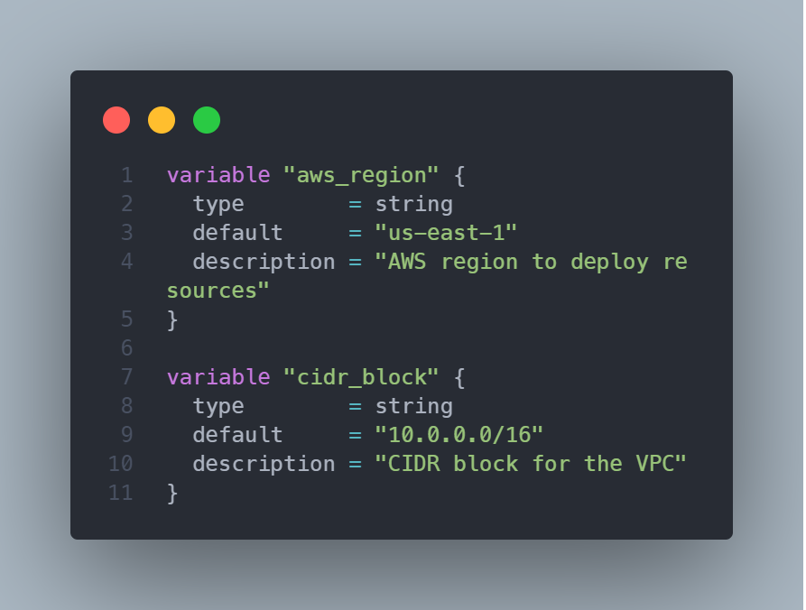
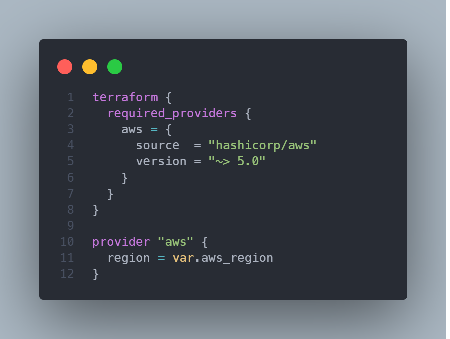
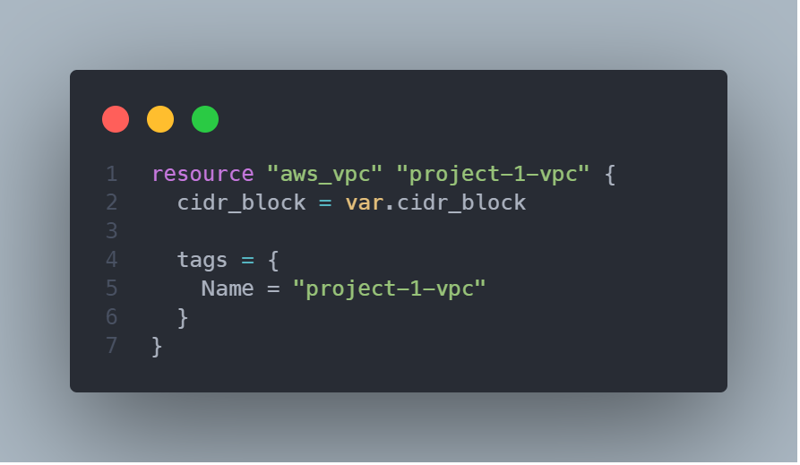
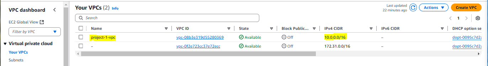
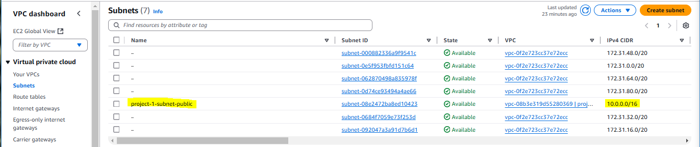
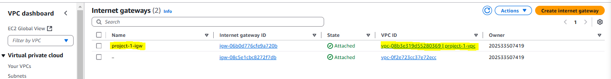

# Create Linux Server on AWS with Terraform

## Pequisites:

1.  **AWS Account:** You need an active AWS account: 

2. **Terraform Installed:** Download and install Terraform from the official website: 

3. **AWS CLI Installed and Configured for Linux:** Ensure the  is installed and configured with your credentials using `aws configure`.

4. **Basic Linux and Cloud Concepts:** Familiarity with basic Linux commands and cloud computing concepts will be helpful.


## File Structure for the project

project-1_creating-linux-server-on-aws/       (Root Directory)
├── main.tf                                   (Main resource definitions)
├── provider.tf                               (AWS provider configuration)
├── variables.tf                              (Variable definitions)
├── outputs.tf                                (Output definitions)
├── README.md                                 (Project documentation)


## Step-by-Step Guide:

### Create a Terraform Project Directory

Create a new directory for your Terraform configuration files. Let's name it `project-1_creating-linux-server-on-aws`:

```bash
    mkdir project-1_creating-linux-server-on-aws
    cd project-1_creating-linux-server-on-aws
```

### Add Initial Terraform Code

Update the `main.tf`, `variable.tf` and `provider.tf` files before initializing providers `registry.terraform.io/hashicorp/aws`.

- **variables.tf**


- **provider.tf**


- **main.tf**



### Create VPC

Amazon Virtual Private Cloud (VPC) is a virtual network that allows users to launch AWS resources in a logically isolated section of the AWS cloud. VPCs are similar to traditional networks that run in a data center, but with the scalability of AWS.

We need to create a `vpc` for the linux server.




### Create Public Subnet

For this project, I will be accessing the linux server from outside the AWS environment so I need to create a `public subnet`.

```hcl
resource "aws_subnet" "project-1-subnet" {
  vpc_id     = aws_vpc.project-1-vpc.id
  cidr_block = var.cidr_block
  availability_zone = "us-east-1a"

  tags = {
    Name = "project-1-subnet-public"
  }
}

```


Run the following terraform commands to confirm that there are no errors in the code;

```bash
terraform fmt
```

```bash
terraform validate
```
Then follow up with `terraform plan` and `terraform apply`.


### Create Internet Gateway

An internet gateway is a horizontally scaled, redundant, and highly available VPC component that enables communication between your VPC and the internet.
To use an internet gateway, attach it to your VPC and specify it as a target in your subnet route table for internet-routable IPv4 or IPv6 traffic.

```hcl
resource "aws_internet_gateway" "project-1-igw" {
  vpc_id = aws_vpc.project-1-vpc.id

  tags = {
    Name = "project-1-igw"
  }
}
```



