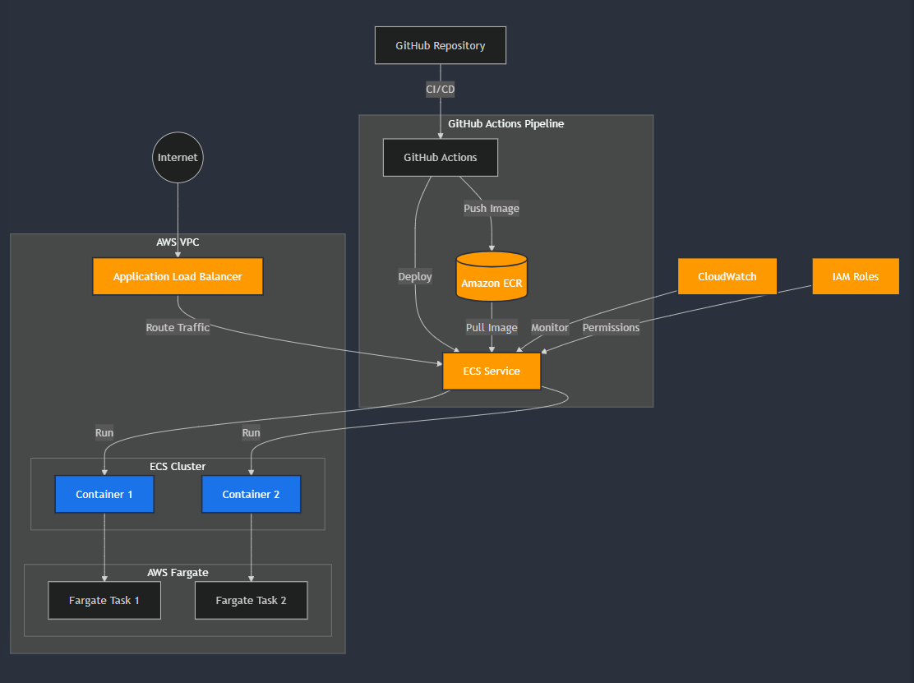
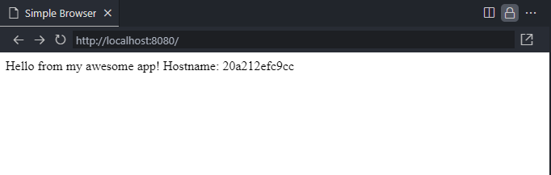

# Host a Flask Application on AWS ECS Fargate

## Architecture Diagram




**Project Overview:**

We'll create a simple Python Flask web application, containerize it with Docker, deploy it to AWS Fargate using Terraform and Jenkins, and set up monitoring with Prometheus and Grafana.

**Step 1: Set Up AWS Credentials and Terraform**

1.  **Install the AWS CLI:**  Follow the instructions here: [https://docs.aws.amazon.com/cli/latest/userguide/install-cliv2.html](https://docs.aws.amazon.com/cli/latest/userguide/install-cliv2.html)
2.  **Configure the AWS CLI:** Run `aws configure` and provide your AWS Access Key ID, Secret Access Key, default region (e.g., `us-east-1`), and output format (e.g., `json`). Make sure the IAM user/role you are using has the necessary permissions to create resources (EC2, ECS, IAM, etc.).  For simplicity in this project, grant AdministratorAccess, but for real-world scenarios, *strictly limit* the permissions to only what's needed.
3.  **Install Terraform:** Follow the instructions here: [https://www.terraform.io/downloads](https://www.terraform.io/downloads)
4.  **Verify Installation:** Open a terminal and run `terraform --version`.

**Step 2: Create a Simple Python Flask Web Application**

Create a directory named `project-2_host-a-website-on-ecs_fargate`. Inside this directory, create the following files:

*   `app.py`:

```python
# flask-app/app.py
from flask import Flask
import os

app = Flask(__name__)

@app.route("/")
def hello():
    return f"Hello from my awesome app!  Hostname: {os.uname()[1]}"

if __name__ == "__main__":
    app.run(debug=True, host='0.0.0.0', port=int(os.environ.get('PORT', 8080)))
```

*   `requirements.txt`:

```
Flask
```

**Step 3: Dockerize the Flask Application**

Create a `Dockerfile` in the `project-2_host-a-website-on-ecs_fargate` directory:

```dockerfile
# project-2_host-a-website-on-ecs_fargate/Dockerfile
FROM python:3.9-slim-buster

WORKDIR /app

COPY requirements.txt .
RUN pip install --no-cache-dir -r requirements.txt

COPY . .

EXPOSE 8080

CMD ["python", "app.py"]
```

Build and test the Docker image locally:

```bash
cd project-2_host-a-website-on-ecs_fargate
docker build -t project-2_host-a-website-on-ecs_fargate .
docker run -d -p 8080:8080 project-2_host-a-website-on-ecs_fargate
```

Open your web browser and go to `http://localhost:8080`.  You should see the "Hello" message.



**Step 4: Create Terraform Modules for Infrastructure Deployment**

Create a directory named `terraform` in the `project-2_host-a-website-on-ecs_fargate` directory.  Inside this directory, create the following files:

*   `terraform/main.tf`:  This will orchestrate the module calls.

```terraform
# terraform/main.tf
terraform {
  required_providers {
    aws = {
      source  = "hashicorp/aws"
      version = "~> 5.0"  # Or your desired version
    }
  }
}

provider "aws" {
  region = "us-east-1"  # Replace with your desired region
}
```
* Run the following terraform commands to confirm that there are no errors in the code;

```bash
cd terraform
```

```bash
terraform init
```

```bash
terraform fmt
```

```bash
terraform validate
```

* Configure the Terraform Modules for `VPC`, `ECS Cluster`, `Fargate Service`, `Prometheus`, `Grafana`;

```terraform
# Module for VPC
module "vpc" {
  source = "./modules/vpc"
  vpc_cidr = "10.0.0.0/16"
  availability_zones = ["us-east-1a", "us-east-1b"]
}

# Module for ECS Cluster
module "ecs" {
  source = "./modules/ecs"
  name = "my-ecs-cluster"
  vpc_id = module.vpc.vpc_id
  subnet_ids = module.vpc.private_subnets # Use private subnets for ECS Fargate
}

# Module for Fargate Service
module "fargate" {
  source = "./modules/fargate"
  cluster_name = module.ecs.cluster_name
  task_definition_name = "host-website-on-ecs-fargate"
  task_definition_cpu = 256
  task_definition_memory = 512
}
