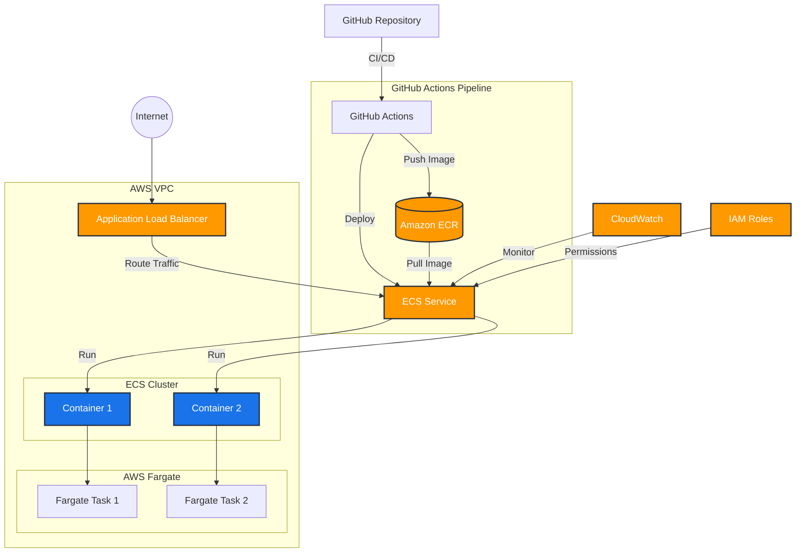

# Project Title: 
Automated Web App Deployment & Monitoring on AWS ECS/Fargate

## Goal: 
To create a CI/CD pipeline that automatically deploys and monitors a simple web application on AWS using Docker, ECS/Fargate, Terraform, GitHub Actions, and CloudWatch.

## Prerequisites:
- AWS Account
- Docker
- Terraform
- GitHub Account
- Python
- Flask

## Technologies and AWS Services Used

### Core Technologies
- **Terraform**: Infrastructure as Code (IaC) tool for provisioning and managing AWS resources
- **Docker**: Containerization platform for packaging the application and its dependencies
- **Python**: Programming language used for the web application
- **Flask**: Lightweight web framework for Python
- **GitHub Actions**: CI/CD platform for automated deployments

### AWS Services

#### Compute & Containers
- **Amazon ECS (Elastic Container Service)**
  - Container orchestration service
  - Manages deployment and scaling of Docker containers
  - Used with Fargate launch type for serverless container management

- **AWS Fargate**
  - Serverless compute engine for containers
  - Eliminates need to manage EC2 instances
  - Handles underlying infrastructure automatically

#### Networking
- **Amazon VPC (Virtual Private Cloud)**
  - Isolated network environment
  - Custom network configuration with public subnets
  - Internet Gateway for public access

- **Application Load Balancer (ALB)**
  - Distributes incoming traffic across multiple targets
  - Handles HTTP/HTTPS traffic
  - Provides health checks for containers

#### Container Registry
- **Amazon ECR (Elastic Container Registry)**
  - Stores and manages Docker container images
  - Integrated with ECS for container deployment
  - Provides secure, private image storage

#### Security & Identity
- **IAM (Identity and Access Management)**
  - Manages access to AWS services
  - Task execution roles for ECS
  - Security policies for services interaction

#### Monitoring & Logging
- **Amazon CloudWatch**
  - Container logs and metrics
  - Application performance monitoring
  - Resource utilization tracking
  - Alarms for critical metrics

## Architecture Overview
- Web application runs in containers on ECS/Fargate
- Traffic flows through ALB to container instances
- Multiple availability zones for high availability
- Automated deployments via GitHub Actions
- Continuous monitoring with CloudWatch

### Architecture Diagram



## Architecture Flow

1. **User Access**
   - Users access the application through the internet
   - Traffic is directed to the Application Load Balancer

2. **CI/CD Pipeline**
   - Code is pushed to GitHub repository
   - GitHub Actions triggers the CI/CD pipeline
   - Docker image is built and pushed to ECR
   - New deployment is triggered on ECS

3. **Container Deployment**
   - ECS pulls the latest image from ECR
   - Fargate provides serverless compute
   - Containers are distributed across multiple tasks

4. **Monitoring and Security**
   - CloudWatch monitors the entire stack
   - IAM roles manage service permissions
   - Security groups control network access

5. **High Availability**
   - Multiple Fargate tasks across AZs
   - Load balancer ensures traffic distribution
   - Auto-scaling based on demand

## Security Features
- Private VPC with controlled access
- Security groups for network traffic control
- IAM roles for least-privilege access
- Encrypted communication between services

## Phase 1: Setting Up the Web Application (Simple Python Flask App)

### Create Directory Structure

First, create the following directory structure:

```
terraform/
├── main.tf
├── variables.tf
├── outputs.tf
├── modules/
│   ├── networking/
│   │   ├── main.tf
│   │   ├── variables.tf
│   │   └── outputs.tf
│   ├── security/
│   │   ├── main.tf
│   │   ├── variables.tf
│   │   └── outputs.tf
│   ├── iam/
│   │   ├── main.tf
│   │   ├── variables.tf
│   │   └── outputs.tf
│   └── ecs/
│       ├── main.tf
│       ├── variables.tf
│       └── outputs.tf
```
### Create application directory

1. Create a directory for the application:

```bash
mkdir project-2_host-a-website-on-ecs_fargate
```
- Navigate to the application directory:

```bash
cd project-2_host-a-website-on-ecs_fargate
```

2. Create `app.py` file (simple flask app):

```py
# app.py
from flask import Flask
import os
app = Flask(__name__)

@app.route("/")
def hello():
    return f"Hello from my Web App! Running on host: {os.uname()[1]}"

if __name__ == "__main__":
    app.run(debug=True, host='0.0.0.0', port=int(os.environ.get('PORT', 8080)))
```

3. Create `requirements.txt` file (dependencies):

```txt
# requirements.txt
Flask
```

4. Create `Dockerfile` (containerization):

```docker
# Dockerfile
FROM python:3.9-slim-buster
WORKDIR /app
COPY requirements.txt .
RUN pip install --no-cache-dir -r requirements.txt
COPY . .
EXPOSE 8080
CMD ["python", "app.py"]
```

## Phase 2: Building the Infrastructure with Terraform

- Install Terraform: Follow the instructions for your OS: https://www.terraform.io/.
- Create a Terraform Directory:

```py
import os

def create_terraform_structure():
    # Define the base directory
    base_dir = "terraform"
    
    # Define modules and their files
    modules = ["networking", "security", "iam", "ecs"]
    module_files = ["main.tf", "variables.tf", "outputs.tf"]
    
    # Create base directory
    os.makedirs(base_dir, exist_ok=True)
    
    # Create root files
    root_files = ["main.tf", "variables.tf", "outputs.tf"]
    for file in root_files:
        open(os.path.join(base_dir, file), 'a').close()
    
    # Create modules directory and module files
    modules_dir = os.path.join(base_dir, "modules")
    os.makedirs(modules_dir, exist_ok=True)
    
    for module in modules:
        module_dir = os.path.join(modules_dir, module)
        os.makedirs(module_dir, exist_ok=True)
        
        for file in module_files:
            open(os.path.join(module_dir, file), 'a').close()

if __name__ == "__main__":
    create_terraform_structure()
    print("Terraform directory structure created successfully!")
```

- Navigate to the terraform directory:

```bash
cd terraform
```
- Initialize Terraform:

```bash
terraform init
```
- Apply Terraform:

```bash
terraform apply
```
Type yes when prompted. This will create the infrastructure in your AWS account.


## Phase 3: Containerizing the Application and Pushing to ECR

Create an ECR Repository:

Go to the AWS Console, navigate to Elastic Container Registry (ECR), and create a new repository (e.g., my-web-app). Note the repository URI.

Authenticate Docker with ECR: (Run these commands in your terminal, replacing <AWS_ACCOUNT_ID> and <AWS_REGION> with your actual values.)

aws ecr get-login-password --region <AWS_REGION> | docker login --username AWS --password-stdin <AWS_ACCOUNT_ID>.dkr.ecr.<AWS_REGION>.amazonaws.com
Use code with caution.
Bash
Build and Tag the Docker Image: (From the web-app directory)

docker build -t my-web-app .
docker tag my-web-app:latest <AWS_ACCOUNT_ID>.dkr.ecr.<AWS_REGION>.amazonaws.com/my-web-app:latest
Use code with caution.
Bash
Push the Image to ECR:

docker push <AWS_ACCOUNT_ID>.dkr.ecr.<AWS_REGION>.amazonaws.com/my-web-app:latest
Use code with caution.
Bash
Update main.tf: Replace "YOUR_ECR_IMAGE_URL" with the actual ECR image URL in the aws_ecs_task_definition resource:

image = "<AWS_ACCOUNT_ID>.dkr.ecr.<AWS_REGION>.amazonaws.com/my-web-app:latest",
Use code with caution.
Terraform
Then re-run terraform apply.


## Phase 4: Setting up CI/CD with GitHub Actions

Create a GitHub Repository:

Create a new repository on GitHub for your project.

Push Your Code to GitHub:

git init
git add .
git commit -m "Initial commit"
git remote add origin <YOUR_GITHUB_REPOSITORY_URL>
git push -u origin main


Create a GitHub Actions Workflow: Create a file named .github/workflows/deploy.yml in your repository:

# .github/workflows/deploy.yml
name: Deploy to ECS

on:
  push:
    branches:
      - main  # Trigger on pushes to the main branch

env:
  AWS_REGION: us-east-1  # Replace with your AWS region
  ECR_REPOSITORY: my-web-app  # Replace with your ECR repository name
  ECS_SERVICE: my-app-service # Replace with your ECS service name
  ECS_CLUSTER: my-ecs-cluster # Replace with your ECS cluster name
  TASK_DEFINITION: terraform/aws_ecs_task_definition.app_task.json # Path to your task definition JSON (see next step)

permissions:
  id-token: write
  contents: read

jobs:
  deploy:
    runs-on: ubuntu-latest

    steps:
    - name: Checkout code
      uses: actions/checkout@v3

    - name: Configure AWS credentials
      uses: aws-actions/configure-aws-credentials@v2
      with:
        role-to-assume: arn:aws:iam::<AWS_ACCOUNT_ID>:role/github-actions-role # Replace with the ARN of your github actions IAM role
        aws-region: ${{ env.AWS_REGION }}

    - name: Login to Amazon ECR
      id: login-ecr
      uses: aws-actions/amazon-ecr-login@v1

    - name: Build, tag, and push image to Amazon ECR
      id: build-image
      env:
        ECR_REGISTRY: ${{ steps.login-ecr.outputs.registry }}
        IMAGE_TAG: latest
      run: |
        # Build a docker container and push it to ECR
        docker build -t $ECR_REGISTRY/$ECR_REPOSITORY:$IMAGE_TAG .
        docker push $ECR_REGISTRY/$ECR_REPOSITORY:$IMAGE_TAG
        echo "image=$ECR_REGISTRY/$ECR_REPOSITORY:$IMAGE_TAG" >> $GITHUB_OUTPUT

    - name: Fill in the new image ID in the Amazon ECS task definition
      id: task-def
      uses: aws-actions/amazon-ecs-render-task-definition@v1
      with:
        task-definition: terraform/aws_ecs_task_definition.app_task.json
        container-name: my-app-container # Replace with your container name
        image: ${{ steps.build-image.outputs.image }}

    - name: Deploy Amazon ECS task definition
      uses: aws-actions/amazon-ecs-deploy-task-definition@v1
      with:
        task-definition: ${{ steps.task-def.outputs.task-definition }}
        service: ${{ env.ECS_SERVICE }}
        cluster: ${{ env.ECS_CLUSTER }}

Configure GitHub Actions IAM Role:

Create an IAM role that GitHub Actions can assume.

Attach the following policies to the IAM role:

ECR Push: Allows actions to push the images to ECR.

ECS Deploy: Allows Actions to deploy the task definition to ECS.

Trust relationship: This is important, you need to add the github action as a trusted entity. For this go to your IAM role, click "Trust relationships" and "Edit trust policy". Paste the policy below and replace the "ORGANIZATION" with your Github organization and "REPOSITORY" with your repository.

{
    "Version": "2012-10-17",
    "Statement": [
        {
            "Effect": "Allow",
            "Principal": {
                "Federated": "arn:aws:iam::AWS_ACCOUNT_ID:oidc-provider/token.actions.githubusercontent.com"
            },
            "Action": "sts:AssumeRoleWithWebIdentity",
            "Condition": {
                "StringEquals": {
                    "token.actions.githubusercontent.com:aud": "sts.amazonaws.com",
                    "token.actions.githubusercontent.com:sub": "repo:ORGANIZATION/REPOSITORY:*"
                }
            }
        }
    ]
}

Important: To make the deployment work, you will need to render the ECS task definition to JSON so github actions can use it. for this, create aws_ecs_task_definition.app_task.json and run terraform show -json > aws_ecs_task_definition.app_task.json. You might need to install jq to render the task_definition to the desired format for github actions.

terraform show -json | jq '.resource[].values | select(.type == "aws_ecs_task_definition")'  > aws_ecs_task_definition.app_task.json


Commit and push all changes to your GitHub repository.

## Phase 5: Implementing Monitoring with CloudWatch

Logs: CloudWatch Logs is already configured in the aws_ecs_task_definition resource using the logConfiguration block. This will automatically send your application logs to CloudWatch.

Metrics (Example - CPU Utilization): Create a CloudWatch Metric Filter to extract CPU utilization from your logs:

In the AWS Console, navigate to CloudWatch -> Logs -> Log Groups -> /ecs/my-app-task.

Create a Metric Filter.

Filter Pattern: (This will depend on how your application logs CPU usage)

Metric Details:

Metric Namespace: MyWebApp

Metric Name: CPUUtilization

Metric Value: (The value extracted from your log messages)

Unit: Percent

CloudWatch Alarms: Create CloudWatch Alarms to trigger notifications when certain metrics exceed thresholds:

In the AWS Console, navigate to CloudWatch -> Alarms.

Create a new alarm based on the CPUUtilization metric you created.

Configure the alarm to trigger an SNS notification when CPU utilization exceeds a threshold (e.g., 80%).

## Phase 6: Testing and Iteration

Make a Code Change: Modify your app.py file.

Commit and Push: Commit the changes and push them to the main branch of your GitHub repository.

Observe the Pipeline: Watch the GitHub Actions workflow run and automatically deploy the changes to your ECS service.

Check CloudWatch: Verify that your application logs are being sent to CloudWatch and that your alarms are working correctly.

Important Notes:

IAM Permissions: Ensure that the IAM roles you create have the necessary permissions to perform these actions. Start with a narrow set of permissions and gradually expand them as needed.

Security: This guide provides a basic setup. In a production environment, you should implement more robust security measures, such as restricting access to your resources using security groups and IAM policies.

Error Handling: Add error handling to your scripts and workflows to gracefully handle failures.

Variables: Use environment variables to store sensitive information, such as API keys and passwords.

Monitoring: Implement comprehensive monitoring to track the health and performance of your application and infrastructure.

ECS Task Definition Rendering: Use terraform show -json | jq to extract json info.


